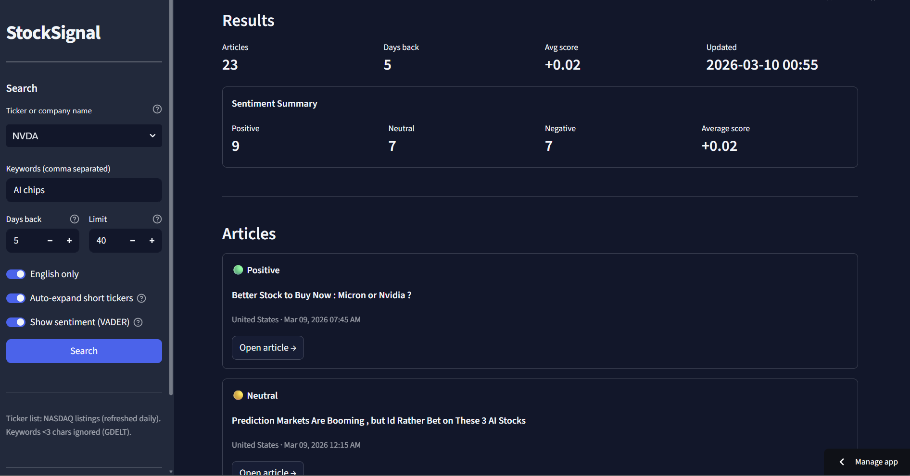

<p align="center">
  <strong>StockSignal</strong>
</p>

<p align="center">
  Analyze financial news and extract <strong>sentiment signals</strong> from global news coverage.
</p>

---

StockSignal is a tool that analyzes financial news and extracts **sentiment signals** from global news coverage.

The application searches the **GDELT global news database** for articles related to a company or stock ticker and applies **VADER sentiment analysis** to classify whether coverage is **positive, neutral, or negative**.

---

## Live Demo

**[→ Open StockSignal](https://stocksignalx.streamlit.app/)**

https://stocksignalx.streamlit.app/

---

## Screenshot




---

## Features

- **Stock / company search** — Query global news coverage for any ticker or company name
- **Keyword filtering** — Narrow results using keywords such as `earnings`, `guidance`, or `investigation`
- **Sentiment analysis** — VADER sentiment classification for article headlines
- **Interactive dashboard** — Explore results through a Streamlit web interface
- **CLI support** — Run queries directly from the command line

---

## Tech Stack

| Layer        | Technology                          |
| ------------ | ------------------------------------ |
| Language     | **Python** — Data fetching, processing, sentiment analysis |
| UI           | **Streamlit** — Interactive web dashboard |
| Data         | **GDELT REST API** — Global news database |
| NLP          | **VADER** — Sentiment analysis       |
| Processing   | **pandas** — Data processing         |
| HTTP         | **requests** — API communication     |

---

## Quick Start

**1. Clone the repository**

```bash
git clone https://github.com/jacobzychowicz/stock-signal.git
cd stock-signal
```

**2. Create a virtual environment**

```bash
python -m venv .venv
```

**3. Activate the environment**

Windows (PowerShell):

```powershell
.venv\Scripts\activate
```

Mac / Linux:

```bash
source .venv/bin/activate
```

**4. Install dependencies**

```bash
pip install -r requirements.txt
```

**5. Run the web app**

```bash
streamlit run app.py
```

---

## CLI Usage

**Example:**

```bash
python main.py MSFT -k "guidance, investigation" -d 5 -l 40
```

### CLI Options

| Option | Description |
|--------|-------------|
| `symbol` | Ticker or company name (e.g. `AAPL`, `"Bank of America"`) |
| `-k` / `--keyword` | Keywords (repeatable or comma-separated) |
| `-d` / `--days` | Days of history (default `3`; `0` = all available) |
| `-l` / `--limit` | Maximum number of articles (1–250) |
| `--allow-non-english` | Include non-English sources |

### Example Queries

```bash
python main.py "NVIDIA" -k "ai, chips, guidance"
python main.py AAPL -k "earnings, outlook" -d 2
python main.py "Tesla" --allow-non-english -l 15
python main.py "Meta" -k "privacy, regulation" -d 7
```

---

## Data Sources

- **GDELT 2.1 Doc API** — [blog.gdeltproject.org](https://blog.gdeltproject.org/gdelt-doc-2-1-api-debuts/)
- **NASDAQ Listings Dataset** — [github.com/datasets/nasdaq-listings](https://github.com/datasets/nasdaq-listings)

---

## Notes

- GDELT may rate-limit requests (HTTP 429). The app retries with backoff.
- Keywords shorter than 3 characters are skipped due to GDELT constraints.
- Sentiment analysis uses the VADER model applied to article headlines.

---

## Future Improvements

Possible future features:

- Sentiment trend visualization
- Multi-stock comparison
- News clustering by topic
- Alert system for sentiment spikes

---

## License

This project is licensed under the **MIT License** — see the [LICENSE](LICENSE) file for details.
